# Basic Info

> Auto-generated by `maa-project-init`. Review TODO items before relying on this file for automation edits.

## 0. Maa Skills 接力协议

`basic_info.md` 是项目上下文缓存，不是 Pipeline 源文件。Maa skills 应先读本节，再按任务读取相关章节，并始终以当前源码和实时设备结果为准。

| Consumer skill | Read first | Must re-verify |
| --- | --- | --- |
| maa-pipeline-guide / maa-pipeline-generate | 3, 4, 5, 7, 8, 9 | 待修改节点及目标页面 |
| maa-pipeline-graph | 2, 3, 6 | 跨文件边、Python 调用和 interface entry |
| maa-pipeline-option | 1, 2, 6 | pipeline_override 与 Python 读取路径 |
| maa-pipeline-testing | 2, 5, 7, 8, 9, 10 | 当前截图、OCR 命中和高风险动作 |

- 若本文件缺失，且当前会话可用 `maa-project-init`，先运行它。
- 若本文件早于相关 Pipeline / interface / agent 文件，视为可能过期；先重跑摘要，不要静默覆盖本文件。
- 发现源码或实机结果与本文冲突时，记录冲突并采用新证据；未经确认不要覆盖已有非空文件。

## 1. 项目概览

- 项目名: `MaaGumballs`
- 根目录: `F:\workspace\MaaGumballs`
- 仓库/主页: https://github.com/KhazixW2/MaaGumballs
- interface: `assets\interface.json`
- 控制器: Adb
- Agent: `{"child_exec": "python", "child_args": ["-u", "./agent/main.py"]}`

## 2. 资源组与入口任务

### Resource groups
| Name | Paths | Existing paths |
| --- | --- | --- |
| 官服 | ./resource/base | 1 |
| xiaomi | ./resource/base, ./resource/mi | 2 |
| huawei | ./resource/base, ./resource/huawei | 2 |
| oppo | ./resource/base, ./resource/oppo | 2 |
| vivo | ./resource/base, ./resource/vivo | 2 |
| 4399 | ./resource/base, ./resource/4399 | 2 |
| bilibili | ./resource/base, ./resource/bilibili | 2 |
| hk_tw | ./resource/base, ./resource/hk_tw | 2 |
| test | ./resource/base, ./resource/test | 2 |
| test-青瓷 | ./resource/base, ./resource/test-qc | 2 |
| tencent | ./resource/base, ./resource/tencent | 2 |
| 9u | ./resource/base, ./resource/9u | 2 |

### Agent script paths

> 接口声明的 agent 入口文件静态扫描结果；只读、不修改 interface.json。

**Declared (interface.json child_args)**

| Arg | Status | Resolved |
| --- | --- | --- |
| -u | non-py | — |
| ./agent/main.py | resolved | F:\workspace\MaaGumballs\agent\main.py |

**Discovered (root 与 4 层 ancestor，按约定入口名扫描)**

| Candidate | Exists |
| --- | --- |
| F:\workspace\MaaGumballs\assets\agent\main.py | no |
| F:\workspace\MaaGumballs\assets\agent\server.py | no |
| F:\workspace\MaaGumballs\assets\agent\agent.py | no |
| F:\workspace\MaaGumballs\assets\agent\run.py | no |
| F:\workspace\MaaGumballs\assets\agent\app.py | no |
| F:\workspace\MaaGumballs\assets\agents\main.py | no |
| F:\workspace\MaaGumballs\assets\agents\server.py | no |
| F:\workspace\MaaGumballs\assets\agents\agent.py | no |
| F:\workspace\MaaGumballs\assets\agents\run.py | no |
| F:\workspace\MaaGumballs\assets\agents\app.py | no |
| F:\workspace\MaaGumballs\agent\main.py | yes |
| F:\workspace\MaaGumballs\agent\server.py | no |
| F:\workspace\MaaGumballs\agent\agent.py | no |
| F:\workspace\MaaGumballs\agent\run.py | no |
| F:\workspace\MaaGumballs\agent\app.py | no |
| F:\workspace\MaaGumballs\agents\main.py | no |
| F:\workspace\MaaGumballs\agents\server.py | no |
| F:\workspace\MaaGumballs\agents\agent.py | no |
| F:\workspace\MaaGumballs\agents\run.py | no |
| F:\workspace\MaaGumballs\agents\app.py | no |
| F:\workspace\agent\main.py | no |
| F:\workspace\agent\server.py | no |
| F:\workspace\agent\agent.py | no |
| F:\workspace\agent\run.py | no |
| F:\workspace\agent\app.py | no |
| F:\workspace\agents\main.py | no |
| F:\workspace\agents\server.py | no |
| F:\workspace\agents\agent.py | no |
| F:\workspace\agents\run.py | no |
| F:\workspace\agents\app.py | no |
| F:\agent\main.py | no |
| F:\agent\server.py | no |
| F:\agent\agent.py | no |
| F:\agent\run.py | no |
| F:\agent\app.py | no |
| F:\agents\main.py | no |
| F:\agents\server.py | no |
| F:\agents\agent.py | no |
| F:\agents\run.py | no |
| F:\agents\app.py | no |

**Cross-check**

- Unresolved declarations: _(none)_
- Discovered but unreferenced: _(none)_
- Referenced but not in convention list: _(none)_

### Task entries
| Task | Entry | Repeatable |
| --- | --- | --- |
| 启动游戏 | Start_Up | false |
| 每日收菜 | DailyTask | false |
| 领取奖励 | Reward_Execute | false |
| 商店自动购物 | Shop | false |
| 自动天空 | AutoSky | false |
| 自动购买金币 | DailyGoldCoin | false |
| 刷竞技场 | JJC | true |
| 自动叫狗 | Fight_CallDog_Func | false |
| 玛尔斯 | Mars | true |
| 神锻系列 | DivineForgeLand_Start | false |
| 时空域 | TSD_Entry | false |
| 自动兑换密令 | AutoCdk | false |
| 退出游戏 | StopGumballs | false |

## 3. 主要 Pipeline

- Pipeline 文件数: 43
- 默认配置文件: assets\resource\base\default_pipeline.json
- 唯一节点数: 657
- 节点定义数: 724

| File | Nodes |
| --- | --- |
| assets\resource\base\pipeline\dailyTask.json | 71 |
| assets\resource\base\pipeline\fight\mars101.json | 70 |
| assets\resource\base\pipeline\sky.json | 67 |
| assets\resource\base\pipeline\activity\kairo_maze1.json | 55 |
| assets\resource\base\pipeline\fight\fight.json | 53 |
| assets\resource\base\pipeline\fight\divineForgeLand.json | 50 |
| assets\resource\base\pipeline\activity\eastern.json | 33 |
| assets\resource\base\pipeline\fight\select.json | 30 |
| assets\resource\base\pipeline\fight\time_space_domain.json | 30 |
| assets\resource\base\pipeline\reward.json | 30 |
| assets\resource\base\pipeline\utils.json | 27 |
| assets\resource\base\pipeline\fight\jjc101.json | 17 |
| assets\resource\base\pipeline\fight\title.json | 16 |
| assets\resource\base\pipeline\save_status.json | 15 |
| assets\resource\base\pipeline\shopping.json | 15 |
| assets\resource\base\pipeline\activity\tl01_fight.json | 14 |
| assets\resource\base\pipeline\fight\foreign_domain.json | 14 |
| assets\resource\base\pipeline\fight\bag.json | 13 |
| assets\resource\base\pipeline\start_up.json | 13 |
| assets\resource\base\pipeline\activity\activity_utils.json | 8 |
| assets\resource\4399\pipeline\save_status.json | 6 |
| assets\resource\base\pipeline\foreign_domain_utils.json | 6 |
| assets\resource\bilibili\pipeline\save_status.json | 6 |
| assets\resource\huawei\pipeline\save_status.json | 6 |
| assets\resource\mi\pipeline\save_status.json | 6 |
| assets\resource\oppo\pipeline\save_status.json | 6 |
| assets\resource\vivo\pipeline\save_status.json | 6 |
| assets\resource\test-qc\pipeline\start_up.json | 5 |
| assets\resource\base\pipeline\fight\pull_string.json | 4 |
| assets\resource\9u\pipeline\save_status.json | 3 |

### 入口主链路流程图

从 `interface.json` 的 task entry 出发，按 `next/on_error/interrupt` 展开有限深度流程图；公共返回、确认、退出节点会自然出现在图中。

#### 启动游戏 (`Start_Up`)

- 入口节点存在: True
- 主路径: `Start_Up -> MainWindow_Check -> MainWindow_Check_Second`
- 图规模: 13 nodes / 13 edges
- 未解析引用: None detected

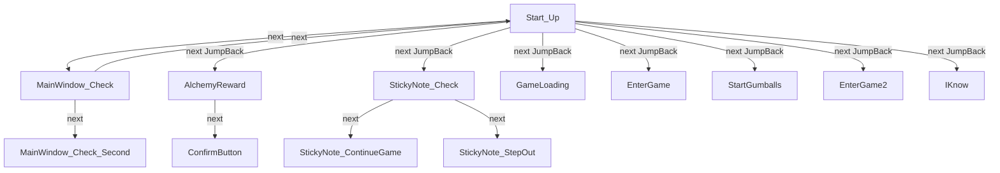

#### 每日收菜 (`DailyTask`)

- 入口节点存在: True
- 主路径: `DailyTask -> EntryEden -> EntryHall -> DailyTaskSelect -> ReturnBigMap -> CheckBigMap`
- 图规模: 12 nodes / 13 edges
- 未解析引用: None detected

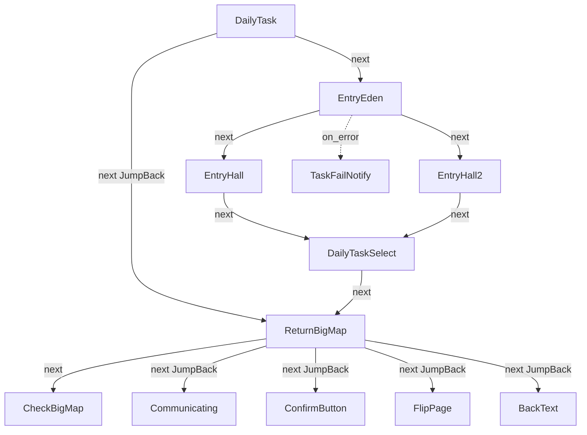

#### 领取奖励 (`Reward_Execute`)

- 入口节点存在: True
- 主路径: `Reward_Execute`
- 图规模: 1 nodes / 0 edges
- 未解析引用: None detected

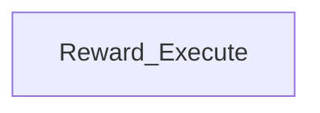

#### 商店自动购物 (`Shop`)

- 入口节点存在: True
- 主路径: `Shop -> EntryUnionShop -> Shop_Start -> ReturnBigMap -> CheckBigMap`
- 图规模: 10 nodes / 10 edges
- 未解析引用: None detected

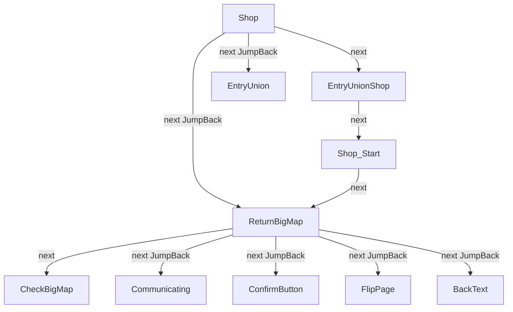

#### 自动天空 (`AutoSky`)

- 入口节点存在: True
- 主路径: `AutoSky`
- 图规模: 1 nodes / 0 edges
- 未解析引用: None detected

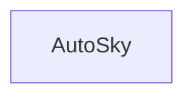

#### 自动购买金币 (`DailyGoldCoin`)

- 入口节点存在: True
- 主路径: `DailyGoldCoin -> DailyGoldCoin_Start -> DailyGoldCoin_BuyClayPot_Costing`
- 图规模: 7 nodes / 7 edges
- 未解析引用: None detected

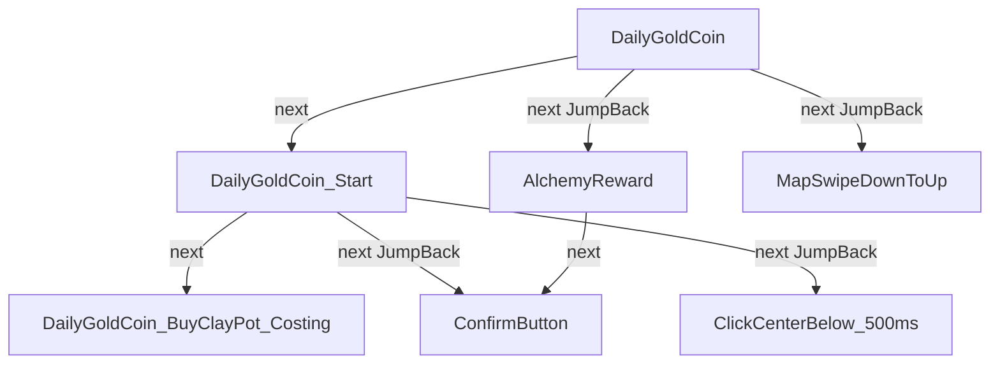

#### 刷竞技场 (`JJC`)

- 入口节点存在: True
- 主路径: `JJC -> JJC_Start -> JJC_Select -> JJC_EntryMaze -> JJC_Fighting`
- 图规模: 13 nodes / 14 edges
- 未解析引用: None detected

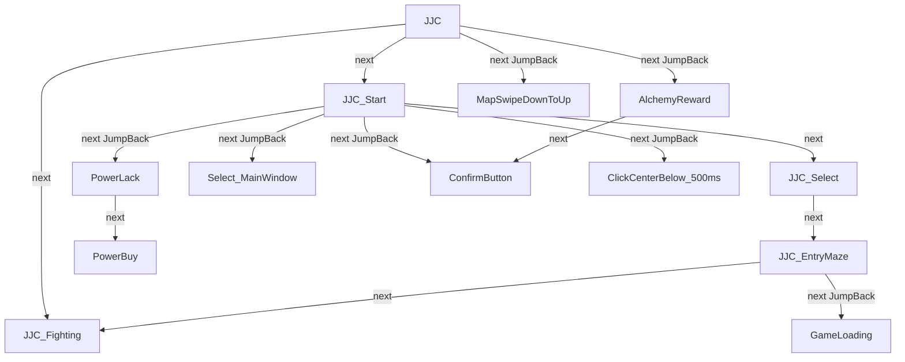

#### 自动叫狗 (`Fight_CallDog_Func`)

- 入口节点存在: True
- 主路径: `Fight_CallDog_Func`
- 图规模: 1 nodes / 0 edges
- 未解析引用: None detected

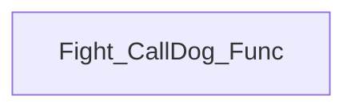

#### 玛尔斯 (`Mars`)

- 入口节点存在: True
- 主路径: `Mars -> Mars_Start -> Mars_Select -> Mars_EntryMaze -> Mars_Fighting`
- 图规模: 16 nodes / 17 edges
- 未解析引用: None detected

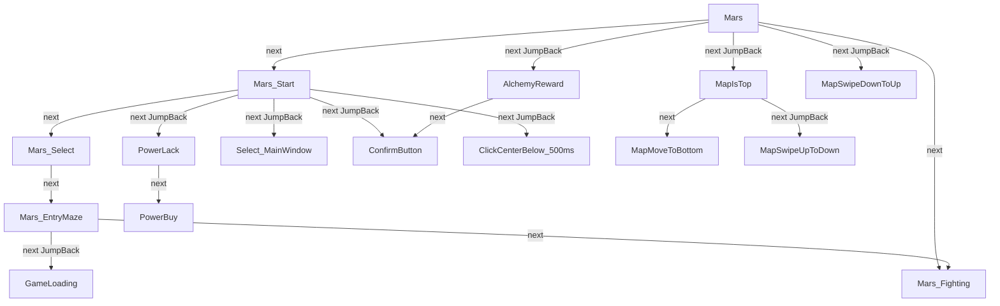

#### 神锻系列 (`DivineForgeLand_Start`)

- 入口节点存在: True
- 主路径: `DivineForgeLand_Start -> PoolTrick`
- 图规模: 2 nodes / 1 edges
- 未解析引用: None detected

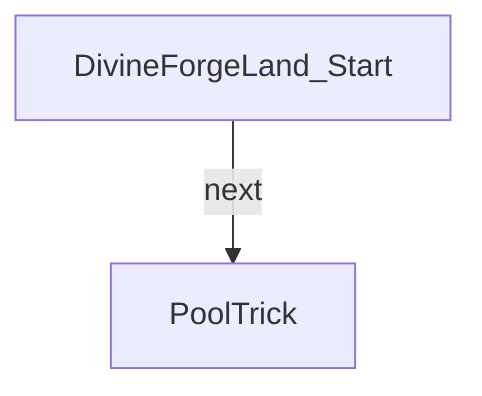

#### 时空域 (`TSD_Entry`)

- 入口节点存在: True
- 主路径: `TSD_Entry -> TSD_GetInDomain -> TSD_GetInDomain_Confirm -> TSD_CheckInTSD -> TSD_Explore`
- 图规模: 7 nodes / 6 edges
- 未解析引用: None detected

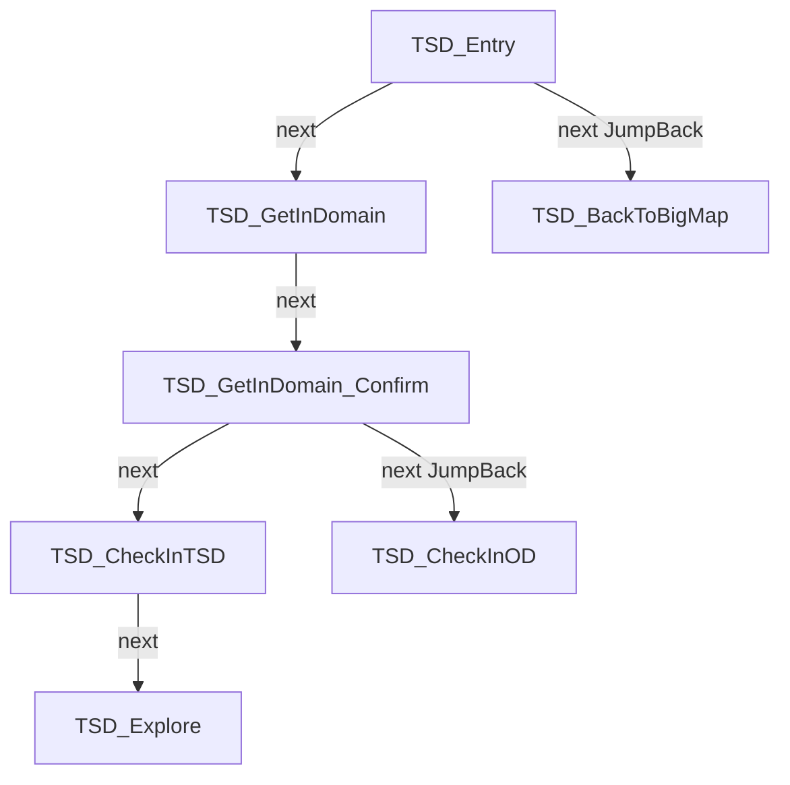

#### 自动兑换密令 (`AutoCdk`)

- 入口节点存在: True
- 主路径: `AutoCdk`
- 图规模: 1 nodes / 0 edges
- 未解析引用: None detected

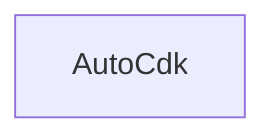

#### 退出游戏 (`StopGumballs`)

- 入口节点存在: True
- 主路径: `StopGumballs`
- 图规模: 1 nodes / 0 edges
- 未解析引用: None detected

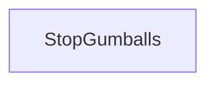

## 4. 公共基础节点

这些节点通常被多条链路引用，或名称/行为显示它们是通用 UI 控制节点。

人工复核记录（2026-07-16）：

- `Fight_MainWindow` 是战斗环境内复用的公共节点。
- `FlipPage` 是获得物资流程中复用的翻页公共节点。
- 此处的“公共”包含领域内公共节点，不要求节点必须在整个项目的所有任务中通用。

| Node | In | Recognition | Action | Categories |
| --- | --- | --- | --- | --- |
| BackText | 26 | OCR | Click | common-ui, high-in-degree, return-exit |
| ConfirmButton | 23 | OCR | Click | common-ui, confirm-cancel, high-in-degree |
| ReturnHall | 16 | DirectHit | <default> | common-ui, high-in-degree, return-exit |
| GameLoading | 14 | OCR | <default> | common-ui, high-in-degree |
| AlchemyReward | 12 | OCR | DoNothing | high-in-degree |
| BackText_500ms | 10 | OCR | Click | common-ui, high-in-degree, return-exit |
| MarsReward_Open | 10 | TemplateMatch | Click | high-in-degree |
| ReturnBigMap | 10 | DirectHit | <default> | common-ui, high-in-degree, return-exit |
| ClickCenter | 8 | DirectHit | Click | high-in-degree |
| StartGumballs | 8 | <default> | StartApp | common-ui, high-in-degree |
| Kairo_PurchaseItem | 7 | OCR | Click | high-in-degree |
| Mars_Inter_Confirm_Success | 7 | OCR | Click | common-ui, confirm-cancel, high-in-degree |
| StickyNote_Check | 7 | <default> | <default> | common-ui, confirm-cancel, high-in-degree |
| Cdk_Select_CdkEntrance | 6 | TemplateMatch | Click | high-in-degree |
| ClickCenterBelow_500ms | 6 | DirectHit | Click | high-in-degree |
| ConfirmButton_500ms | 6 | OCR | Click | common-ui, confirm-cancel, high-in-degree |
| EnterGame | 6 | OCR | Click | high-in-degree |
| LogoutGame_Next | 6 | TemplateMatch | Click | common-ui, high-in-degree, return-exit |
| LogoutGame_Next_2 | 6 | TemplateMatch | Click | common-ui, high-in-degree, return-exit, template-control |
| Mars_Inter_Confirm_Fail | 6 | OCR | Click | common-ui, confirm-cancel, high-in-degree |
| ReturnMaze_Next | 6 | OCR | Click | common-ui, high-in-degree, return-exit |
| ReturnMaze_Next_2 | 6 | OCR | Click | common-ui, high-in-degree, return-exit |
| AutoSky_CheckExplorationInfo | 5 | OCR | <default> | common-ui, high-in-degree |
| Fight_MainWindow | 5 | TemplateMatch | <default> | high-in-degree |
| FlipPage | 5 | OCR | Click | high-in-degree |
| Kairo_ClickPromoteButton | 5 | OCR | Click | high-in-degree |
| Kairo_Internal_Click | 5 | OCR | Click | high-in-degree |
| PowerLack | 5 | OCR | <default> | common-ui, high-in-degree |
| Communicating | 4 | OCR | <default> | common-ui |
| Fight_CheckOpenedDoor | 4 | TemplateMatch | Click | common-ui |

## 5. 返回 / 退出 / 弹窗处理

重点关注返回、退出、关闭、确认、重连、体力不足等流程。MaaGumballs 一类项目常通过 `[JumpBack]` 把这些节点挂到主链路中。

| Node | In | Recognition | Action | Files |
| --- | --- | --- | --- | --- |
| BackText | 26 | OCR | Click | assets\resource\base\pipeline\utils.json |
| ReturnHall | 16 | DirectHit | <default> | assets\resource\base\pipeline\utils.json |
| BackText_500ms | 10 | OCR | Click | assets\resource\base\pipeline\utils.json |
| ReturnBigMap | 10 | DirectHit | <default> | assets\resource\base\pipeline\utils.json |
| LogoutGame_Next | 6 | TemplateMatch | Click | assets\resource\4399\pipeline\save_status.json, assets\resource\bilibili\pipeline\save_status... |
| LogoutGame_Next_2 | 6 | TemplateMatch | Click | assets\resource\4399\pipeline\save_status.json, assets\resource\bilibili\pipeline\save_status... |
| ReturnMaze_Next | 6 | OCR | Click | assets\resource\4399\pipeline\save_status.json, assets\resource\bilibili\pipeline\save_status... |
| ReturnMaze_Next_2 | 6 | OCR | Click | assets\resource\4399\pipeline\save_status.json, assets\resource\bilibili\pipeline\save_status... |
| Fight_ReturnMainWindow | 4 | <default> | <default> | assets\resource\base\pipeline\fight\fight.json |
| StopGumballs | 4 | <default> | StopApp | assets\resource\4399\pipeline\Start_up.json, assets\resource\9u\pipeline\start_up.json, asset... |
| BackText_700ms | 3 | OCR | Click | assets\resource\base\pipeline\utils.json |
| ReturnMazeButton | 3 | TemplateMatch | Click | assets\resource\base\pipeline\save_status.json |
| TL01_checkClosedDoor | 2 | TemplateMatch | DoNothing | assets\resource\base\pipeline\activity\tl01_fight.json |
| TSD_BackToBigMap | 2 | OCR | Click | assets\resource\base\pipeline\fight\time_space_domain.json |
| AutoSky_Disable_CloneClosed | 1 | TemplateMatch | DoNothing | assets\resource\base\pipeline\sky.json |
| AutoSky_Enable_CloneClosed | 1 | TemplateMatch | Click | assets\resource\base\pipeline\sky.json |
| AutoSky_Exit_Radar_Interface | 1 | TemplateMatch | Click | assets\resource\base\pipeline\sky.json |
| AutoSky_TroopLoss_Backtext | 1 | OCR | Click | assets\resource\base\pipeline\sky.json |
| DailyGoldCoin_BuyClayPot_Kickback | 1 | OCR | Click | assets\resource\base\pipeline\dailyTask.json |
| DailyGoldCoin_BuyClayPot_Kickback_Confirm | 1 | OCR | Click | assets\resource\base\pipeline\dailyTask.json |
| Eastern_Leave_Confirm | 1 | OCR | Click | assets\resource\base\pipeline\activity\eastern.json |
| Eastern_REceive_Salary_leave | 1 | OCR | Click | assets\resource\base\pipeline\activity\eastern.json |
| Eastern_WayBack | 1 | OCR | Click | assets\resource\base\pipeline\activity\eastern.json |
| Fight_ClosedDoor | 1 | TemplateMatch | Click | assets\resource\base\pipeline\fight\fight.json |
| Fight_LeaveMaze | 1 | <default> | <default> | assets\resource\base\pipeline\fight\fight.json |
| Fight_LeaveMaze_Leave | 1 | TemplateMatch | Click | assets\resource\base\pipeline\fight\fight.json |
| Fight_LeaveMaze_StopButton | 1 | OCR | Click | assets\resource\base\pipeline\fight\fight.json |
| Kairo_Return_Hotel | 1 | TemplateMatch | Click | assets\resource\base\pipeline\activity\kairo_maze1.json |
| LogoutGame | 1 | <default> | <default> | assets\resource\4399\pipeline\save_status.json, assets\resource\9u\pipeline\save_status.json,... |
| LogoutGame_ClickSwitch | 1 | TemplateMatch | Click | assets\resource\base\pipeline\save_status.json |

### Confirm / Cancel nodes
| Node | In | Recognition | Action |
| --- | --- | --- | --- |
| ConfirmButton | 23 | OCR | Click |
| Mars_Inter_Confirm_Success | 7 | OCR | Click |
| StickyNote_Check | 7 | <default> | <default> |
| ConfirmButton_500ms | 6 | OCR | Click |
| Mars_Inter_Confirm_Fail | 6 | OCR | Click |
| StickyNote_ContinueGame | 4 | OCR | Click |
| TaskFailNotify | 4 | <default> | <default> |
| Kairo_Confirm_Boss | 3 | TemplateMatch | <default> |
| IKnow | 2 | OCR | click |
| Inter_ConfirmButton | 2 | OCR | Click |
| JJC_Inter_Confirm | 2 | OCR | Click |
| Kairo_Confirm_OnBag | 2 | OCR | DoNothing |
| Kairo_Confirm_Onbigmap | 2 | TemplateMatch | DoNothing |
| Mars_Inter_Confirm_Pickup | 2 | OCR | Click |
| Select_Confirm | 2 | OCR | Click |
| TSD_SelectCancelButton | 2 | OCR | Click |
| AlchemySignboard_Confirm | 1 | OCR | Click |
| AutoSky_ActivateTemple_Confirm | 1 | OCR | Click |
| AutoSky_CloneDied_Cancel | 1 | OCR | Click |
| Cdk_Text_Confirm | 1 | OCR | Click |

## 6. 节点关系摘要

- 边数量: 676
- 边类型: `{"next": 666, "on_error": 10}`
- 跨文件引用数: 202
- 未解析引用数: 0
- 孤立节点数: 163
- 重复节点名数: 10
- 疑似循环/SCC 数: 21

资源覆盖语义（人工确认，2026-07-16）：Pipeline JSON 按资源加载顺序合并，先加载的文件作为 base，后加载文件中的同名节点覆盖先前定义。不同平台可能使用不同资源，因此渠道目录中的重复节点名通常是预期的渠道覆盖；分析和修改时应结合实际资源加载顺序判断最终生效定义。

### Top in-degree nodes
| Node | In |
| --- | --- |
| BackText | 26 |
| ConfirmButton | 23 |
| ReturnHall | 16 |
| GameLoading | 14 |
| AlchemyReward | 12 |
| BackText_500ms | 10 |
| ReturnBigMap | 10 |
| MarsReward_Open | 10 |
| StartGumballs | 8 |
| ClickCenter | 8 |
| StickyNote_Check | 7 |
| Kairo_PurchaseItem | 7 |
| Mars_Inter_Confirm_Success | 7 |
| LogoutGame_Next | 6 |
| LogoutGame_Next_2 | 6 |
| ReturnMaze_Next | 6 |
| ReturnMaze_Next_2 | 6 |
| EnterGame | 6 |
| ClickCenterBelow_500ms | 6 |
| ConfirmButton_500ms | 6 |
| Mars_Inter_Confirm_Fail | 6 |
| Cdk_Select_CdkEntrance | 6 |
| Fight_MainWindow | 5 |
| PowerLack | 5 |
| Kairo_Internal_Click | 5 |

### Python / interface 外部入口

- 扫描 Python 文件数: 35
- 静态 Python Pipeline 调用数: 588
- 动态目标调用数: 13
- 外部入口命中节点数: 213
- 排除外部入口后的无入边候选数: 120

人工复核说明（2026-07-16）：部分 Python 动态目标会在运行时临时写入已加载的 Pipeline 目录，因此这些节点可能不在仓库现有 Pipeline JSON 中。静态扫描无法解析这类目标不等于节点缺失；需要结合临时节点的生成与加载逻辑判断。

| Kind | Target | Calls | Sample call site |
| --- | --- | --- | --- |
| run_task | Fight_ReturnMainWindow | 76 | Auto_CallDog @ agent\action\activity\eastern.py:28 |
| run_task | BackText | 32 | AutoCdk.run @ agent\action\activity\eastern.py:275 |
| run_task | Bag_Open | 16 | Auto_CallDog @ agent\action\activity\eastern.py:147 |
| run_task | LogoutGame | 12 | Auto_CallDog @ agent\action\divineForgeLand\someTrick.py:23 |
| run_task | ReturnMaze | 12 | Auto_CallDog @ agent\action\divineForgeLand\someTrick.py:27 |
| run_task | ConfirmButton_500ms | 11 | Mars_Shopping.run @ agent\action\fight\fightUtils.py:390 |
| run_task | WaitStableNode_ForOverride | 11 | FightProcessor.clearCurrentLayer @ agent\action\fight\fightProcessor.py:565 |
| run_task | Fight_OpenedDoor | 10 | Eastern_Activity.handle_ClearMonster @ agent\action\activity\eastern.py:51 |
| run_task | Save_Status | 10 | GoDownstairsTrick_Test.run @ agent\action\divineForgeLand\someTrick.py:192 |
| run_recognition | AutoSky_CheckExplorationInfo | 8 | AutoSky._back_to_radar @ agent\action\sky.py:391 |
| run_recognition | ConfirmButton_500ms | 6 | disassembleEquipment @ agent\action\fight\fightUtils.py:389 |
| run_task | Mars_Inter_Confirm_Success | 6 | Mars101.handle_interrupt_event @ agent\action\fight\mars101.py:265 |
| run_task | ConfirmPutonArmor | 5 | Find_Stove_Sequence_Test.get_base_stove_sequence @ agent\action\divineForgeLand\someTrick.py:707 |
| run_recognition | Fight_OpenedDoor | 5 | FightDownstairManager.handle_downstair_event @ agent\action\fight\downstair.py:75 |
| run_task | OpenEquipmentStovePage | 5 | Find_Stove_Sequence_Test.get_base_stove_sequence @ agent\action\divineForgeLand\someTrick.py:708 |
| run_task | Screenshot | 5 | Mars101.handle_interrupt_event @ agent\action\fight\mars101.py:440 |
| run_task | AutoSky_ReturnSkyMap | 4 | AutoSky._switch_fleet_to_faction @ agent\action\sky.py:418 |
| run_task | Bag_ToNextPage | 4 | Find_Stove_Sequence_Test.add_low_level_equipment @ agent\action\divineForgeLand\someTrick.py:669 |
| run_task | ConfirmButton | 4 | AutoSky._wait_for_event_completion @ agent\action\fight\jjc101.py:712 |
| run_recognition | Fight_FindRespawn | 4 | Eastern_Activity.handle_interrupt_event @ agent\action\activity\eastern.py:55 |
| run_recognition | Fight_Perfect | 4 | JJC101.handle_perfect_event @ agent\action\fight\jjc101.py:398 |
| run_recognition | Mars_GotoSpecialLayer | 4 | Mars101.handle_postLayers_event @ agent\action\fight\mars101.py:449 |
| run_task | ReturnBigMap | 4 | AutoCdk.run @ agent\action\dailyTask.py:47 |
| run_recognition | BackText | 3 | Eastern_Activity.handle_interrupt_event @ agent\action\activity\eastern.py:85 |
| run_task | BackText_500ms | 3 | AutoSky._handle_random_event @ agent\action\sky.py:310 |

## 7. OCR 文字识别约定

以下为扫描到的 `expected` 样例。请人工补充 OCR 易错字、替换规则和跨语言差异。

| Node | Expected | ROI | File |
| --- | --- | --- | --- |
| ReturnMaze_Next | ["确定", "确认"] | [24, 639, 677, 293] | assets\resource\4399\pipeline\save_status.json |
| ReturnMaze_Next_2 | 继续冒险 | [28, 649, 340, 180] | assets\resource\4399\pipeline\save_status.json |
| Activity_Select_Hard | 困难模式 | [52, 330, 621, 553] | assets\resource\base\pipeline\activity\activity_utils.json |
| Activity_Select | 进入(.*?)迷宫 | [94, 272, 572, 561] | assets\resource\base\pipeline\activity\activity_utils.json |
| Activity_EntryMaze | 进入迷宫 | [173, 867, 398, 87] | assets\resource\base\pipeline\activity\activity_utils.json |
| Activity_EntryMazeUpdate | 更换 | [102, 701, 223, 70] | assets\resource\base\pipeline\activity\activity_utils.json |
| Eastern_Enter | 进入(.*?)迷宫 | [194, 880, 209, 76] | assets\resource\base\pipeline\activity\eastern.json |
| Eastern_limitedTime_Activity | 限时活动 | [436, 152, 118, 49] | assets\resource\base\pipeline\activity\eastern.json |
| Eastern_Newyear_Activity | 新年庆典 | [125, 261, 151, 51] | assets\resource\base\pipeline\activity\eastern.json |
| Eastern_WayBack | 东方的归途 | [212, 898, 127, 49] | assets\resource\base\pipeline\activity\eastern.json |
| Eastern_OCR_EasyMode | 简单模式 | [72, 634, 191, 57] | assets\resource\base\pipeline\activity\eastern.json |
| Eastern_Select_EasyMode | 简单模式 | [72, 634, 191, 57] | assets\resource\base\pipeline\activity\eastern.json |
| Eastern_Receive_Salary_Confirm | 领取工资 | [267, 799, 192, 66] | assets\resource\base\pipeline\activity\eastern.json |
| Eastern_REceive_Salary_leave | 离开 | [267, 799, 192, 66] | assets\resource\base\pipeline\activity\eastern.json |
| Eastern_Handoff | 挂断 | [12, 216, 700, 758] | assets\resource\base\pipeline\activity\eastern.json |
| Eastern_Enter_Market_Confirm | 进入 | [12, 216, 700, 758] | assets\resource\base\pipeline\activity\eastern.json |
| Eastern_Buy_One_Confirm | 购买 | [245, 791, 272, 89] | assets\resource\base\pipeline\activity\eastern.json |
| Eastern_Buy_Ticket_Confirm | 买票 | [105, 717, 249, 224] | assets\resource\base\pipeline\activity\eastern.json |
| Eastern_Leave_Confirm | 新年快乐 | [260, 806, 153, 59] | assets\resource\base\pipeline\activity\eastern.json |
| Eastern_get_count | \d+ | [108, 292, 72, 51] | assets\resource\base\pipeline\activity\eastern.json |
| Eastern_Inter_Confirm_Success | ["赏花灯", "进入", "加入"] | [29, 545, 652, 394] | assets\resource\base\pipeline\activity\eastern.json |
| Eastern_Inter_Confirm_Fail | ["离开"] | [29, 545, 652, 394] | assets\resource\base\pipeline\activity\eastern.json |
| Kairo_Internal_Click | ["进入"] | [224, 720, 290, 210] | assets\resource\base\pipeline\activity\kairo_maze1.json |
| Kairo_GumballHaveRest | ["阵亡"] |  | assets\resource\base\pipeline\activity\kairo_maze1.json |
| Kairo_Relive_RestPoint | 墓地 | [80, 357, 569, 618] | assets\resource\base\pipeline\activity\kairo_maze1.json |
| Kairo_Save_Status | 住宿并保存 | [247, 869, 230, 75] | assets\resource\base\pipeline\activity\kairo_maze1.json |
| Kairo_PurchaseMembers | 招募 | [69, 1175, 129, 74] | assets\resource\base\pipeline\activity\kairo_maze1.json |
| Kairo_PurchaseItem | 确认购买 | [246, 780, 217, 73] | assets\resource\base\pipeline\activity\kairo_maze1.json |
| Kairo_ClickEquipmentBar1 | ["使用道具"] | [52, 1178, 165, 64] | assets\resource\base\pipeline\activity\kairo_maze1.json |
| Kairo_ClickEquipmentBar2 | ["使用道具"] | [52, 1178, 165, 64] | assets\resource\base\pipeline\activity\kairo_maze1.json |
| Kairo_ClickChangeCharacter | ["使用道具"] | [52, 1178, 165, 64] | assets\resource\base\pipeline\activity\kairo_maze1.json |
| Kairo_ClickPromotionInterface | ["使用道具"] | [52, 1178, 165, 64] | assets\resource\base\pipeline\activity\kairo_maze1.json |
| Kairo_Confirm_OnBag | ["背包"] | [326, 608, 66, 43] | assets\resource\base\pipeline\activity\kairo_maze1.json |
| Kairo_Confirm_OnRoleInterface | ["使用道具"] | [52, 1178, 165, 64] | assets\resource\base\pipeline\activity\kairo_maze1.json |
| Kairo_Confirm_OutsideMap | 飞艇 | [284, 1221, 148, 58] | assets\resource\base\pipeline\activity\kairo_maze1.json |
| ChangeEquipment | 更换装备 | [262, 693, 186, 327] | assets\resource\base\pipeline\activity\kairo_maze1.json |
| Kairo_EquipItem | 装备 | [274, 747, 174, 74] | assets\resource\base\pipeline\activity\kairo_maze1.json |
| Kairo_ClickPromoteButton | 转职 | [305, 823, 110, 280] | assets\resource\base\pipeline\activity\kairo_maze1.json |
| TL01_SelectEasy | 简单模式 | [52, 330, 621, 553] | assets\resource\base\pipeline\activity\tl01_fight.json |
| TL01_SelectEasy_Interrupt | 进入联动迷宫 | [152, 649, 423, 88] | assets\resource\base\pipeline\activity\tl01_fight.json |

## 8. TemplateMatch 图片模板

- 图片文件数: 553

### Image directories
| Directory | Count |
| --- | --- |
| base/fight\Mars | 73 |
| base/fight\UniversalUI | 47 |
| base/dailyTask\weeklyRaid | 37 |
| base/fight\kairo_maze | 37 |
| base/fight\divineForgeLand | 36 |
| base/fight\time_space_domain | 32 |
| base/utils | 30 |
| base/dailyTask | 20 |
| base/equipments\2level | 20 |
| base/equipments\1level | 18 |
| base/equipments\3level | 18 |
| base/equipments\4level | 18 |
| base/equipments\5level | 18 |
| base/items\scroll | 18 |
| base/items | 17 |
| base/equipments\6level | 15 |
| base/fight\eastern | 13 |
| base/fight\JJC | 10 |
| base/fight | 9 |
| base/items\star_scroll | 9 |
| base/sky | 8 |
| base/equipments\777level | 7 |
| base/fight\TL01 | 6 |
| base/Shop | 6 |
| base/fight\buff | 5 |
| base/fight\FOA | 5 |
| base/fight\Mars\MarsExchangeDir\ExchangeForDagger | 5 |
| base/equipments\7level | 4 |
| base/fight\Mars\MarsExchangeDir\ExchangeForHighlevel | 3 |
| base/fight\Mars\MarsExchangeDir\ExchangeForHighlevel_2 | 3 |
| base/items\mars_star_scroll | 3 |
| base/reward | 2 |
| base/startUp | 1 |

### TemplateMatch usage samples
| Node | Template | ROI | File |
| --- | --- | --- | --- |
| LogoutGame_Next | ["utils/AccountInfo.png"] | [66, 344, 595, 663] | assets\resource\4399\pipeline\save_status.json |
| LogoutGame_Next_2 | utils/LogoutButton.png | [0, 1125, 270, 154] | assets\resource\4399\pipeline\save_status.json |
| ReturnMaze | ["utils/StartGame.png"] | [133, 691, 428, 166] | assets\resource\4399\pipeline\save_status.json |
| Activity_Entry | fight/kairo_maze/entry.png | [331, 150, 174, 915] | assets\resource\base\pipeline\activity\activity_utils.json |
| Activity_Fighting | fight/UniversalUI/MazePackage.png | [47, 1147, 136, 117] | assets\resource\base\pipeline\activity\activity_utils.json |
| Eastern_Entry | fight/eastern/entry.png | [7, 155, 705, 887] | assets\resource\base\pipeline\activity\eastern.json |
| Eastern_Fighting | fight/UniversalUI/MazePackage.png | [47, 1147, 136, 117] | assets\resource\base\pipeline\activity\eastern.json |
| Eastern_Select_EasyMode_Check | items/电能试剂.png | [31, 529, 664, 313] | assets\resource\base\pipeline\activity\eastern.json |
| Eastern_Receive_Salary | fight/eastern/monkey.png | [12, 216, 700, 758] | assets\resource\base\pipeline\activity\eastern.json |
| Eastern_Enter_Market | fight/eastern/market.png | [12, 216, 700, 758] | assets\resource\base\pipeline\activity\eastern.json |
| Eastern_Enter_Market_Check | fight/eastern/monkey2.png | [12, 216, 700, 758] | assets\resource\base\pipeline\activity\eastern.json |
| Eastern_Buy_One | fight/eastern/shop5.png | [12, 216, 700, 758] | assets\resource\base\pipeline\activity\eastern.json |
| Eastern_Buy_All | fight/eastern/shop1.png | [12, 216, 700, 758] | assets\resource\base\pipeline\activity\eastern.json |
| Eastern_Buy_All_AddButton | fight/Mars/MarsExchangeShop_ClickAddButton.png | [12, 216, 700, 758] | assets\resource\base\pipeline\activity\eastern.json |
| Eastern_Buy_Ticket | fight/eastern/boss.png | [12, 216, 700, 758] | assets\resource\base\pipeline\activity\eastern.json |
| Eastern_Leave | fight/eastern/villageHead.png | [12, 216, 700, 758] | assets\resource\base\pipeline\activity\eastern.json |
| Eastern_cacl_count | fight/eastern/红包.png | [12, 216, 700, 758] | assets\resource\base\pipeline\activity\eastern.json |
| Kairo_Return_Home | fight/kairo_maze/home.png | [47, 883, 68, 94] | assets\resource\base\pipeline\activity\kairo_maze1.json |
| Kairo_Return_Hotel | fight/kairo_maze/hotel.png | [599, 503, 91, 94] | assets\resource\base\pipeline\activity\kairo_maze1.json |
| Kairo_Relive | fight/kairo_maze/kairoRestPoint.png | [11, 794, 230, 266] | assets\resource\base\pipeline\activity\kairo_maze1.json |
| Kairo_Relive_Gumball | fight/kairo_maze/GumballCoinIcon.png | [28, 492, 641, 526] | assets\resource\base\pipeline\activity\kairo_maze1.json |
| Kairo_Enter_Cave1 | fight/kairo_maze/cave_01.png | [29, 238, 680, 738] | assets\resource\base\pipeline\activity\kairo_maze1.json |
| Kairo_Enter_Cave2 | fight/kairo_maze/cave_02.png | [29, 238, 680, 738] | assets\resource\base\pipeline\activity\kairo_maze1.json |
| Kairo_Enter_Cave3 | fight/kairo_maze/cave_03.png | [29, 238, 680, 738] | assets\resource\base\pipeline\activity\kairo_maze1.json |
| Kairo_Enter_Cave7 | fight/kairo_maze/cave_07.png | [29, 238, 680, 738] | assets\resource\base\pipeline\activity\kairo_maze1.json |
| Kairo_Click_Bell | fight/kairo_maze/bell.png | [8, 597, 453, 391] | assets\resource\base\pipeline\activity\kairo_maze1.json |
| Kairo_Click_Bell_Boss | fight/kairo_maze/bell.png | [39, 899, 65, 65] | assets\resource\base\pipeline\activity\kairo_maze1.json |
| Kairo_Fight_OpenedDoor | ["fight/openedDoor.png", "fight/openedDoor1.png", "fight/openedDoor1_time_stop.png"] | [5, 122, 707, 947] | assets\resource\base\pipeline\activity\kairo_maze1.json |
| Kairo_Enter_Pub | fight/kairo_maze/pub.png | [26, 659, 86, 73] | assets\resource\base\pipeline\activity\kairo_maze1.json |
| Kairo_SearchingMale | fight/kairo_maze/male.png | [146, 566, 44, 51] | assets\resource\base\pipeline\activity\kairo_maze1.json |
| Kairo_Enter_WeaponStore | fight/kairo_maze/WeaponStore.png | [173, 239, 79, 66] | assets\resource\base\pipeline\activity\kairo_maze1.json |
| Kairo_Enter_ArmorStore | fight/kairo_maze/ArmorStore.png | [28, 247, 82, 84] | assets\resource\base\pipeline\activity\kairo_maze1.json |
| Kairo_Enter_WarriorPromotionStore | fight/kairo_maze/WarriorPromotionStore.png | [453, 257, 93, 74] | assets\resource\base\pipeline\activity\kairo_maze1.json |
| Kairo_Enter_SupportPromotionStore | fight/kairo_maze/SupportPromotionStore.png | [599, 249, 94, 80] | assets\resource\base\pipeline\activity\kairo_maze1.json |
| Kairo_Enter_MonkPromotionStore | fight/kairo_maze/MonkPromotionStore.png | [598, 384, 87, 83] | assets\resource\base\pipeline\activity\kairo_maze1.json |
| Kairo_Choose_WarriorMedal | fight/kairo_maze/WarriorMedal.png | [120, 529, 105, 108] | assets\resource\base\pipeline\activity\kairo_maze1.json |
| Kairo_Choose_SupportMedal | fight/kairo_maze/SupportMedal.png | [120, 529, 105, 108] | assets\resource\base\pipeline\activity\kairo_maze1.json |
| Kairo_Choose_MonkMedal | fight/kairo_maze/MonkMedal.png | [120, 529, 105, 108] | assets\resource\base\pipeline\activity\kairo_maze1.json |
| Kairo_Choose_MonkMedal_4 | fight/kairo_maze/MonkMedal_4.png | [315, 568, 55, 46] | assets\resource\base\pipeline\activity\kairo_maze1.json |
| Kairo_Choose_Axe | fight/kairo_maze/Axe.png | [51, 524, 614, 475] | assets\resource\base\pipeline\activity\kairo_maze1.json |

## 9. 分辨率与 ROI 约定

- MaaMCP ADB 默认按截图短边 720 归一化；横屏/竖屏通过截图宽高判断。
- Pipeline 中的 ROI 应结合项目实际截图基准确认，不要盲目从其他设备复制。
- TODO: 用一次实机 `screencap` 记录目标设备分辨率、方向、DPI 和常用页面 ROI。

| Node | ROI | File |
| --- | --- | --- |
| LogoutGame_Next | [66, 344, 595, 663] | assets\resource\4399\pipeline\save_status.json |
| LogoutGame_Next_2 | [0, 1125, 270, 154] | assets\resource\4399\pipeline\save_status.json |
| ReturnMaze | [133, 691, 428, 166] | assets\resource\4399\pipeline\save_status.json |
| ReturnMaze_Next | [24, 639, 677, 293] | assets\resource\4399\pipeline\save_status.json |
| ReturnMaze_Next_2 | [28, 649, 340, 180] | assets\resource\4399\pipeline\save_status.json |
| Activity_Entry | [331, 150, 174, 915] | assets\resource\base\pipeline\activity\activity_utils.json |
| Activity_Select_Hard | [52, 330, 621, 553] | assets\resource\base\pipeline\activity\activity_utils.json |
| Activity_Select | [94, 272, 572, 561] | assets\resource\base\pipeline\activity\activity_utils.json |
| Activity_EntryMaze | [173, 867, 398, 87] | assets\resource\base\pipeline\activity\activity_utils.json |
| Activity_EntryMazeUpdate | [102, 701, 223, 70] | assets\resource\base\pipeline\activity\activity_utils.json |
| Activity_Fighting | [47, 1147, 136, 117] | assets\resource\base\pipeline\activity\activity_utils.json |
| Eastern_Entry | [7, 155, 705, 887] | assets\resource\base\pipeline\activity\eastern.json |
| Eastern_Enter | [194, 880, 209, 76] | assets\resource\base\pipeline\activity\eastern.json |
| Eastern_Fighting | [47, 1147, 136, 117] | assets\resource\base\pipeline\activity\eastern.json |
| Eastern_limitedTime_Activity | [436, 152, 118, 49] | assets\resource\base\pipeline\activity\eastern.json |
| Eastern_Newyear_Activity | [125, 261, 151, 51] | assets\resource\base\pipeline\activity\eastern.json |
| Eastern_WayBack | [212, 898, 127, 49] | assets\resource\base\pipeline\activity\eastern.json |
| Eastern_OCR_EasyMode | [72, 634, 191, 57] | assets\resource\base\pipeline\activity\eastern.json |
| Eastern_Select_EasyMode | [72, 634, 191, 57] | assets\resource\base\pipeline\activity\eastern.json |
| Eastern_Select_EasyMode_Check | [31, 529, 664, 313] | assets\resource\base\pipeline\activity\eastern.json |
| Eastern_Receive_Salary | [12, 216, 700, 758] | assets\resource\base\pipeline\activity\eastern.json |
| Eastern_Receive_Salary_Confirm | [267, 799, 192, 66] | assets\resource\base\pipeline\activity\eastern.json |
| Eastern_REceive_Salary_leave | [267, 799, 192, 66] | assets\resource\base\pipeline\activity\eastern.json |
| Eastern_Handoff | [12, 216, 700, 758] | assets\resource\base\pipeline\activity\eastern.json |
| Eastern_Enter_Market | [12, 216, 700, 758] | assets\resource\base\pipeline\activity\eastern.json |
| Eastern_Enter_Market_Confirm | [12, 216, 700, 758] | assets\resource\base\pipeline\activity\eastern.json |
| Eastern_Enter_Market_Check | [12, 216, 700, 758] | assets\resource\base\pipeline\activity\eastern.json |
| Eastern_Buy_One | [12, 216, 700, 758] | assets\resource\base\pipeline\activity\eastern.json |
| Eastern_Buy_One_Confirm | [245, 791, 272, 89] | assets\resource\base\pipeline\activity\eastern.json |
| Eastern_Buy_All | [12, 216, 700, 758] | assets\resource\base\pipeline\activity\eastern.json |

### MaaMCP 实机验证记录

- 当前状态: `static-scan-only`（生成器不会把未验证的截图猜测写成事实）。
- 记录格式: 时间、controller/device、截图尺寸与方向、页面证据、测试节点、score、是否执行动作。
- 同一次验证的 OCR 与截图必须确认来自稳定的同一页面；画面切换时分别记录，不能合并为永久事实。
- TODO: 使用 `DoNothing` 探针验证至少一个公共返回/确认节点，并保留 TaskDetail 结果。

## 10. 风险清单与待确认项

- 未解析引用: None detected
- 图内孤立节点样例: Activity_Start_Count, AddLowLevelEquipment, AutoCdk, AutoSky, AutoSky_BagConfig, AutoSky_ChangeTarget, AutoSky_CheckEnergyZero, AutoSky_CheckNodeCountZero, AutoSky_CheckRandomEvent, AutoSky_CheckRandomEventDetail, AutoSky_CheckTargetNum, AutoSky_Clcik_FleetIcon, AutoSky_ClickOptionByName, AutoSky_Click_ClonerIcon, AutoSky_Click_ReturnIcon, AutoSky_Click_TreasureIcon, AutoSky_CloneConfig, AutoSky_ExploreRandomEvent, AutoSky_GreenCheck, AutoSky_RiftColor, AutoSky_RiftDetection, AutoSky_SkyExplore_CheckUI, AutoSky_SkyExplore_Start, AutoSky_TalkEvent, Bag_CheckItem, Bag_DisassembleAllItem, Bag_DisassembleItem, Bag_FindItem, Bag_LoadAllItem, Bag_LoadItem
- 排除外部入口后的无入边候选: Activity_Start_Count, AlchemySignboard, AutoSky_BagConfig, AutoSky_CheckRandomEventDetail, AutoSky_CheckSkyLevel, AutoSky_Clcik_FleetIcon, AutoSky_Click_ClonerIcon, AutoSky_Click_ReturnIcon, AutoSky_Click_TreasureIcon, AutoSky_CloneConfig, AutoSky_GreenCheck, AutoSky_SkyExplore_CheckUI, Cdk_Sources, CheckClosedDoor, CircusTask, CloseNotice, ConfirmButton_Select, DailySignIn, DailySweep, Eastern_Select_EasyMode_Check, Eastern_Start, EmptyNode, Enabled_Qmsg, FD_Entry, FD_SwipeMapToDown, Fight_ClearCurrentLayer_time_stop, Fight_ClickDarkMagicPage, Fight_ClickEarthMagicPage, Fight_ClickFireMagicPage, Fight_ClickQiMagicPage
- Python 动态目标调用数: 13（已人工确认：可能由运行时临时写入加载目录，不要求全部存在于静态 Pipeline JSON）
- 外部入口未解析引用: CallEarning_Reco, CheckEternalSuit, CheckFirstEquipmentLevel_empty_box, CheckShopListWindows, Clickitem, Eastern_enter_confirm, EnterShop, Fight_FindRespawnText, GetPlanetName, GetTaskTargetList, GridCheckTargetBoundary, GridCheckTemplate, Mars_GetDemonTitle_Confirm, Shop_FindGoldCionReco, Shop_FindMarsRuinCoinsIcon_reco, Shop_FindMarsSpecialBox_reco, Shop_Mercenary_reco, Shop_RuinCoins_reco, Shop_Runestone_reco, Shop_ShoppingRewards_Check, SkillShop_Reco, TextReco, TitlePanel_CurrentPanel_Check, checkAllFleetStatus, checkClickTarget, checkUnionMsgBox（需按运行时临时节点处理，不直接判定为缺失）
- 重复节点名样例: LogoutGame, LogoutGame_Next, LogoutGame_Next_2, ReturnMaze, ReturnMaze_Next, ReturnMaze_Next_2, StartGumballs, Start_Up, StickyNote_Check, StopGumballs（已确认渠道覆盖机制符合预期：后加载定义覆盖 base）
- 疑似循环样例: [["Cdk_Select_CdkEntrance", "Cdk_Select_Textbox", "Cdk_TextInputAction", "Cdk_Text_Confirm", ...
- Agent script paths unresolved: 0
- Agent script path orphan declarations: 0
- Agent script path unreferenced candidates: 0
- 人工确认进展: `Fight_MainWindow` 是战斗环境公共节点；`FlipPage` 是获得物资翻页公共节点；渠道重复节点按加载顺序覆盖属于预期行为。
- TODO: 继续确认其余高入度业务节点的复用范围，以及哪些节点属于历史遗留。
- TODO: 对关键入口任务跑一次 MaaMCP 实机截图/OCR，补充游戏首页、弹窗、返回路径。
